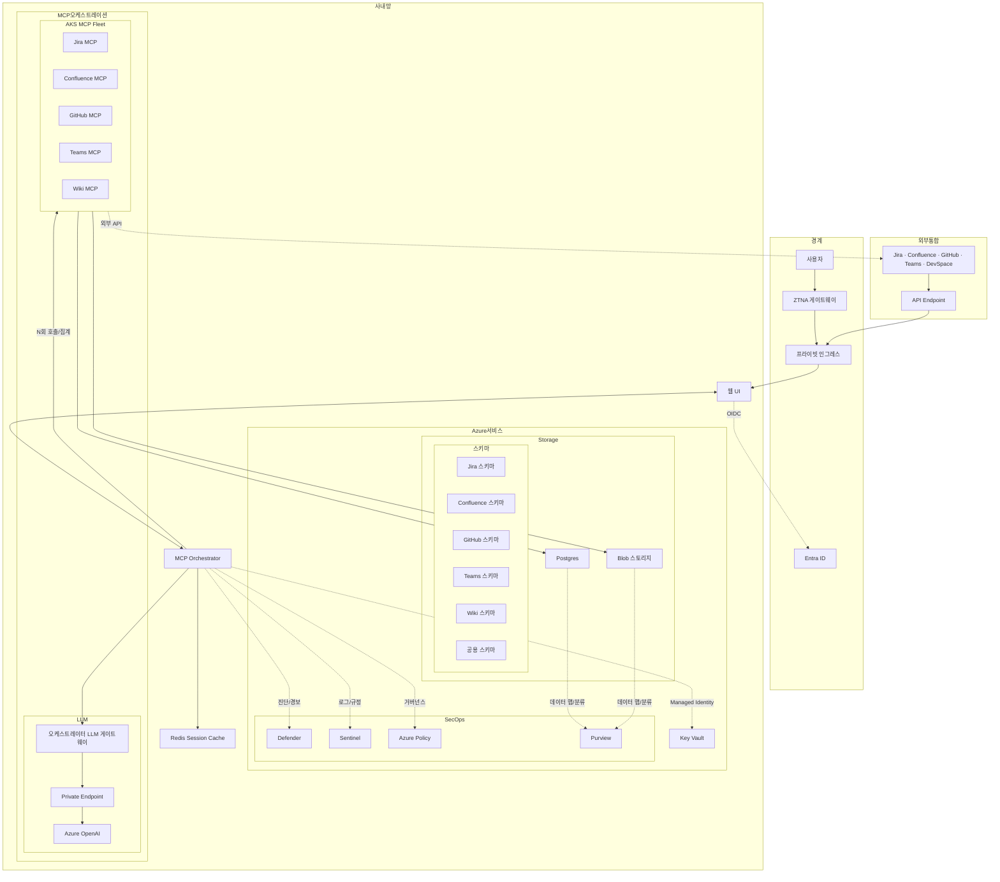
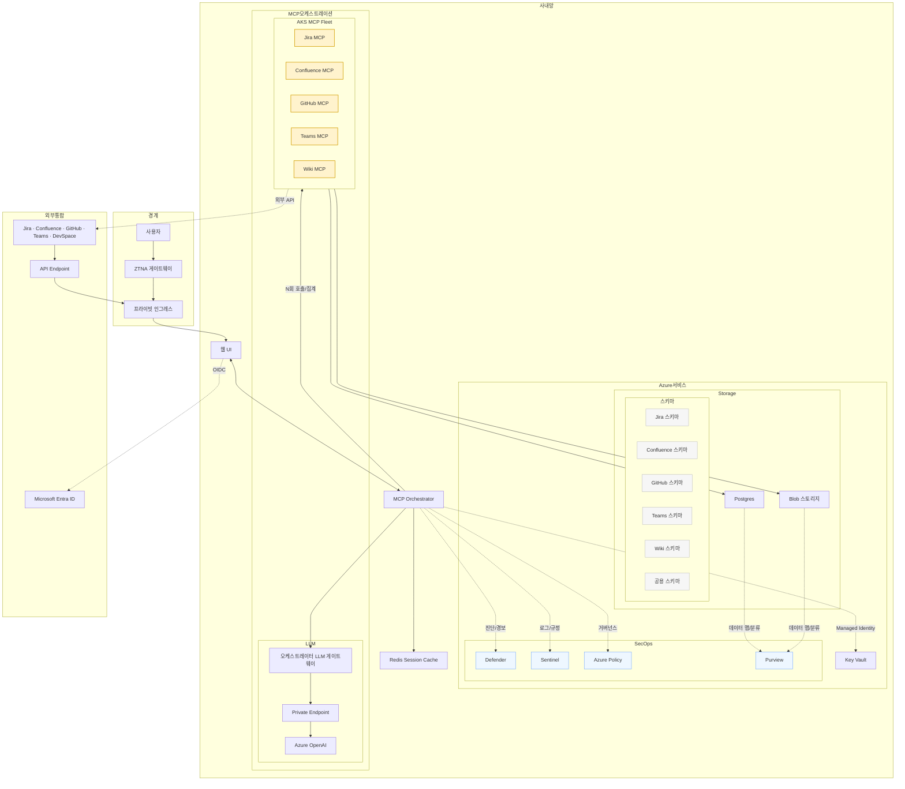

# 디딤돌(didimdol) 시스템 아키텍처(요약)

본 문서는 전체 아키텍처 개요만 제공합니다. 세부 문서는 아래 링크를 참고하세요.

- [UX 디자인](./UX-DESIGN.md)
---

## 🏗️ 전체 아키텍처 개요

### 한눈에 보기(간단)

> 상태 표기
> - Teams 회의 수집/요약: 설계 반영(문서/다이어그램), 백엔드 미구현
> - LLM 기반 템플릿/Q&A: 설계 반영(오케스트레이터 경유), 구현 일부 또는 미구현

### 자세히 보기

### 핵심 설계 원칙
1. MCP는 도메인 어댑터. **LLM 호출은 오케스트레이터 전용**.
2. **스키마 분리** 우선. 트래픽 증가 시 번들 DB로 분리.
3. **3LO 사용자 위임**을 기본 권한 모델로 사용.
4. 토큰은 **DB 저장 + KV 키로 봉투암호화**.
5. SaaS egress는 **NAT/Firewall FQDN 화이트리스트**.
6. Teams는 **Webhook→Queue→Ingestion MCP**.
7. AOAI/DB/Blob **Private Endpoint + Private DNS**.

### 시스템 아키텍처 다이어그램(자세히 보기)

---

**문서 정보(요약본)**
- **버전**: v2.0 (MCP 중심 아키텍처 설계서)
- 상세 내용은 상단 링크의 분리 문서를 참고하세요.

### Azure 네이티브 보안 적용(요약)
- **신원/비밀**: Entra ID(OIDC/CA), Managed Identity, Key Vault(PIM/Secretless)
- **네트워크**: VNet 통합, Private Link/Endpoint로 OpenAI/DB/Blob 폐회로화
- **데이터**: CMK 암호화, RBAC, Purview 분류·DLP 연계
- **위협/컴플라이언스**: Defender for Cloud, Microsoft Sentinel, Azure Policy로 기준선/감사 자동화

---