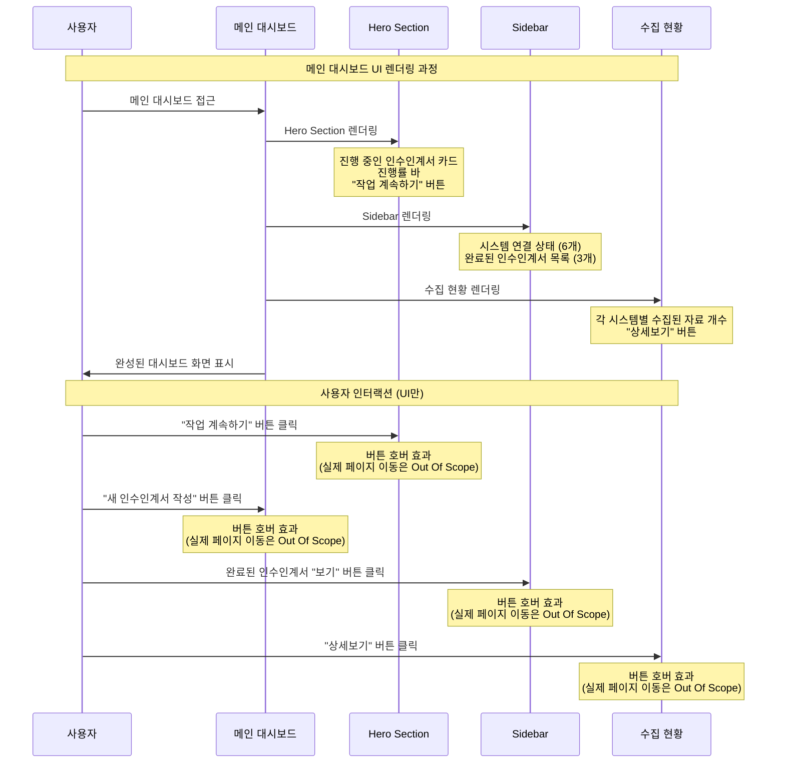
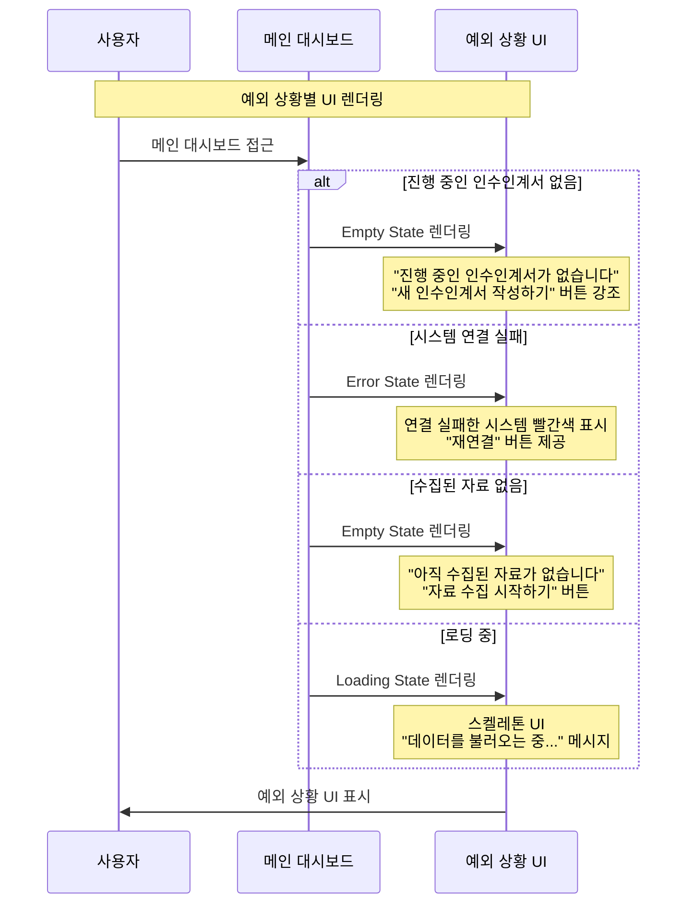

# UI 설계서: 메인 대시보드

**관련 문서**: [001_메인_대시보드_UI_구축.md](./001_메인_대시보드_UI_구축.md)

---

## 개발자에게 전달할 핵심 정보

### **1. 화면 구성 (Frontend만)**
**메인 화면에 표시될 것들:**

**왼쪽 큰 영역 (Hero Section)**
- 현재 진행 중인 인수인계서 카드
- 진행률 바 (75% 완료)
- "작업 계속하기" 버튼

**오른쪽 작은 영역 (Sidebar)**
- 시스템 연결 상태 (6개 시스템 아이콘)
- 완료된 인수인계서 목록 (최근 3개)

**하단 영역**
- 수집된 자료 현황 (각 시스템별 개수)
- "새 인수인계서 작성" 버튼

---

### **2. 예외 상황 UI**
**데이터가 없을 때 보여줄 화면들:**

**진행 중인 인수인계서가 없는 경우**
- "진행 중인 인수인계서가 없습니다" 메시지
- "새 인수인계서 작성하기" 버튼 강조

**완료된 인수인계서가 없는 경우**
- "아직 완료된 인수인계서가 없습니다" 메시지
- "첫 인수인계서 작성하기" 버튼

**시스템 연결 실패**
- 연결 실패한 시스템을 빨간색으로 표시
- "재연결" 버튼 제공

**수집된 자료가 없는 경우**
- "아직 수집된 자료가 없습니다" 메시지
- "자료 수집 시작하기" 버튼

---

### **3. 샘플 데이터 (개발용)**
**진행 중인 인수인계서**
- 제목: "수도AMI 시스템 인수인계서"
- 진행률: 75%
- 담당자: "김현우"
- 시작일: "2025-09-16"

**완료된 인수인계서 (3개)**
- "로그인 시스템 인수인계서" (완료일: 2025-09-16)
- "결제 모듈 인수인계서" (완료일: 2025-09-14)
- "알림 서비스 인수인계서" (완료일: 2025-09-11)

**시스템 연결 상태**
- Confluence: 연결됨
- Github: 연결됨
- Jira: 연결됨
- Wiki: 연결됨
- Teams: 연결됨
- Slack: 연결 안됨

**수집된 자료 현황**
- Confluence: 15건
- Github: 3개
- Jira: 47건
- Wiki: 8건

---

### **4. 개발 우선순위**
**1순위 (필수)**
- 기본 대시보드 레이아웃
- Hero Section (진행 중인 인수인계서)
- Sidebar (시스템 상태 + 완료된 인수인계서)

**2순위 (중요)**
- 예외 상황 UI (Empty State)
- 수집된 자료 현황 표시
- 로딩 상태 UI

**3순위 (선택)**
- 호버 효과
- 애니메이션
- 반응형 디자인

---

### **5. 기술 스택 (Frontend만)**
**Frontend**: React
**스타일링**: CSS 또는 Styled Components
**아이콘**: 이모지 또는 아이콘 라이브러리

---

### **6. 개발 시 주의사항**
**UI/UX**
- 화면 로딩 시간 3초 이내
- 로딩 중일 때 스켈레톤 UI 표시
- 데이터가 없을 때 적절한 안내 제공

**디자인**
- KT 브랜드 컬러 사용 (Red, Mint)
- 일관된 둥근 모서리 (16px, 8px, 4px)
- 명확한 시각적 계층

---

## 7. 시퀀스 다이어그램 (UI 구축 관점)

---

## 8. 예외 상황 시퀀스 다이어그램

---

**작성일**: 2025-09-18  
**작성자**: UX Expert  
**버전**: v1.0  
**상태**: UI 설계 완료
